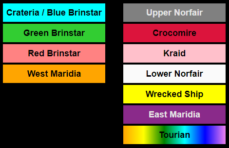
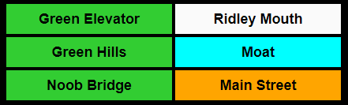
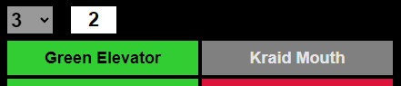
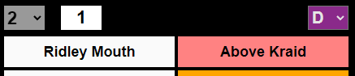

**sm-area-tracker** is a web-based utility for tracking transitions between areas when running Super Metroid Area Randomizer seeds generated using the [VARIA Randomizer](http://varia.run) or the [DASH Randomizer](https://dashrando.net).

This tracker is hosted at [https://masshesteria.github.io/sm-area-tracker](https://masshesteria.github.io/sm-area-tracker) but can also be run locally simply by downloading the source code and opening the `src/index.htm` file in a browser.

## Layout

All area transition portals are listed in different colors based on the area from which the portal is entered.

## Usage

Right click on a portal to select it and then left click on another portal to link them together. Portals will be listed next to each other once linked.

Links can be overridden by simply linking another portal. This is useful when the wrong portal is accidentally clicked.

When overriding links, it is common to have an _orphaned link_ from the original mapping. The link for a portal can be removed by right clicking a portal again and then left clicking that same portal. This operation only modifies the value displayed next to the clicked portal.

## Full Countdown

There is a dropdown above each area section where the number of major items in that area can be selected for tracking Full Countdown seeds. Once the number of major items for the area is specified, a button will appear next to the dropdown. Left clicking the button will decrement the number shown on the button and right click the button will increment the number.

The number of unknown items is also shown under the Tourian portal once the number of majors is specified for at least one area.

## Boss Randomization

Areas with bosses have another dropdown on the right side where a boss can be selected. This is useful for tracking seeds with Boss Randomization enabled.

